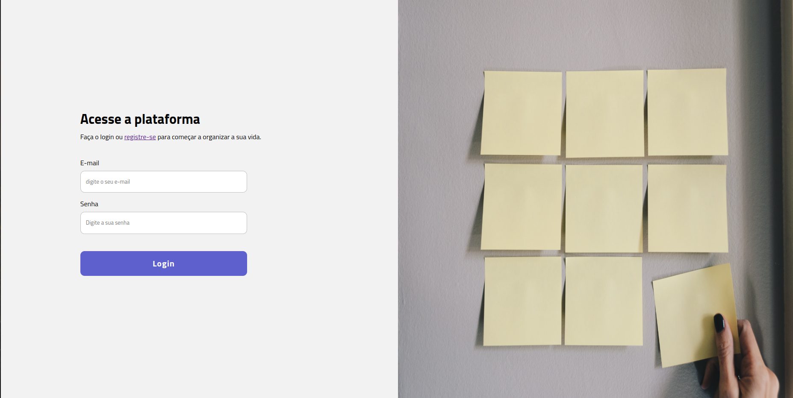

# todo-list

<!---Esses são exemplos. Veja https://shields.io para outras pessoas ou para personalizar este conjunto de escudos. Você pode querer incluir dependências, status do projeto e informações de licença aqui--->




Projeto desenvolvido utilizando usando como motivação incrementar o projeto do módulo 1 da plataforma ignite da [Rocketseat](https://www.rocketseat.com.br/) trazendo, além do desenvolvimento da interface da aplicação, feito com React e styled-components, a conexão com uma API externa [todo-list-api](https://github.com/uitalorss/todo-list-api), cuja documentação [está nesse link](https://dindin-api-azvd.onrender.com/api-docs).

### Ajustes e melhorias

O projeto ainda está em desenvolvimento e as próximas atualizações serão voltadas nas seguintes tarefas:

- [ ] Animações para carregamento das tarefas

### Funcionalidades

- Cadastro de usuário.
- Login de usuário.
- Listagem de Tarefas.
- Cadastro de tarefa.
- Exclusão de tarefa.
- Marcação de tarefa como concluída.
- Edição de tarefa.

## 🚀 Instalando o todo-list

Para instalar o projeto, instale as dependências usando o comando abaxo:

npm:

```
npm install
```

yarn:

```
yarn add
```

## ☕ Usando DindinAPI

Para usar o DindinAPI, siga estas etapas:

npm:

```
npm run dev
```

yarn:

```
yarn dev
```

Deploy

```

```

Adicione comandos de execução e exemplos que você acha que os usuários acharão úteis. Fornece uma referência de opções para pontos de bônus!

## 📫 Contribuindo para todo-list

<!---Se o seu README for longo ou se você tiver algum processo ou etapas específicas que deseja que os contribuidores sigam, considere a criação de um arquivo CONTRIBUTING.md separado--->

Para contribuir com todo-list, siga estas etapas:

1. Bifurque este repositório.
2. Crie um branch: `git checkout -b <nome_branch>`.
3. Faça suas alterações e confirme-as: `git commit -m '<mensagem_commit>'`
4. Envie para o branch original: `git push origin <nome_do_projeto> / <local>`
5. Crie a solicitação de pull.

Como alternativa, consulte a documentação do GitHub em [como criar uma solicitação pull](https://help.github.com/en/github/collaborating-with-issues-and-pull-requests/creating-a-pull-request).

## 🤝 Colaboradores

Agradecemos às seguintes pessoas que contribuíram para este projeto:

<table>
  <tr>
    <td align="center">
      <a href="#">
        <br>
        <sub>
          <b>Uítalo Souza</b>
        </sub>
      </a>
    </td>
  </tr>
</table>

[⬆ Voltar ao topo](#nome-do-projeto)<br>
